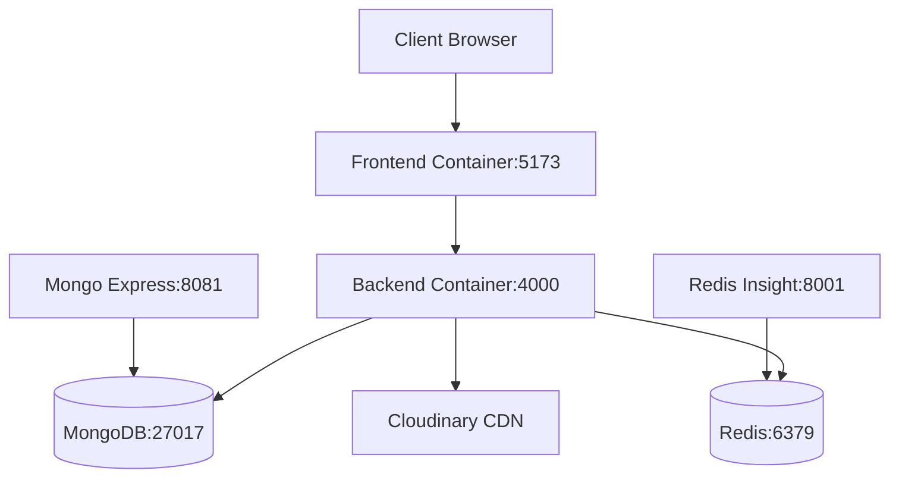

# 🛒 Tech-Kart - Modern E-Commerce Platform

<div align="center">


[](https://www.docker.com/)
[](https://www.typescriptlang.org/)
[](https://www.mongodb.com/)
[](https://redis.io/)

**A full-stack, production-ready e-commerce platform with an advanced admin dashboard, real-time analytics, and seamless payment integration.**

[Features](#-features) • [Tech Stack](#-tech-stack) • [Quick Start](#-quick-start) • [Documentation](#-documentation)

</div>

---

## 📋 Table of Contents

- [Overview](#-overview)
- [Features](#-features)
- [Tech Stack](#-tech-stack)
- [Prerequisites](#-prerequisites)
- [Quick Start](#-quick-start)
  - [Development Setup](#development-setup)
  - [Production Deployment](#production-deployment)
- [Environment Variables](#-environment-variables)
- [Project Structure](#-project-structure)
- [API Documentation](#-api-documentation)
- [Docker Architecture](#-docker-architecture)
- [Database Seeding](#-database-seeding)
- [Contributing](#-contributing)
- [License](#-license)

---

## 🌟 Overview

**Tech-Kart** is a modern, scalable e-commerce platform built with cutting-edge technologies. It provides a seamless shopping experience for customers and powerful management tools for administrators. The application features real-time data synchronization, advanced caching strategies, and a responsive design that works flawlessly across all devices.

### 🎯 Key Highlights

- **🔐 Secure Authentication** - Firebase-based authentication with protected routes
- **💳 Payment Integration** - Stripe payment gateway for secure transactions
- **📊 Admin Dashboard** - Comprehensive analytics with interactive charts and real-time data
- **🚀 High Performance** - Redis caching for optimal response times
- **📦 Product Management** - Full CRUD operations with image uploads via Cloudinary
- **🛒 Shopping Cart** - Persistent cart with Redux state management
- **📱 Responsive Design** - Mobile-first approach with modern UI/UX
- **🐳 Docker Ready** - One-command deployment with Docker Compose
- **📈 Real-time Analytics** - Sales trends, revenue tracking, and customer insights

---

## ✨ Features

### 🛍️ Customer Features

- **User Authentication**
  - Firebase-based login/signup
  - Protected routes and persistent sessions
  - User profile management

- **Product Browsing**
  - Advanced search and filtering
  - Category-based navigation
  - Product ratings and reviews
  - Detailed product pages with image galleries

- **Shopping Experience**
  - Add to cart functionality
  - Real-time cart updates
  - Wishlist management
  - Quick checkout process

- **Order Management**
  - Order history and tracking
  - Order status updates
  - Detailed order summaries
  - Download invoices

- **Payment Processing**
  - Secure Stripe integration
  - Multiple payment methods
  - Payment confirmation emails
  - Transaction history

### 👨‍💼 Admin Features

- **Dashboard Analytics**
  - Revenue statistics
  - Sales trends visualization
  - Customer demographics
  - Top-selling products
  - Real-time data updates

- **Product Management**
  - Add/Edit/Delete products
  - Image upload and management
  - Stock tracking
  - Category management
  - Bulk operations

- **Order Management**
  - View all orders
  - Update order status
  - Process refunds
  - Generate reports

- **Customer Management**
  - View customer list
  - Customer analytics
  - Activity tracking

- **Discount & Coupons**
  - Create promotional codes
  - Set discount rules
  - Track coupon usage
  - Expiration management

- **Interactive Charts**
  - Bar charts for sales data
  - Line charts for trends
  - Pie charts for category distribution
  - Custom date range analytics

### 🔧 Admin Tools

- **Coupon Generator** - Create unique discount codes
- **Stopwatch** - Time tracking utility
- **Toss Game** - Decision-making tool

---

## 🛠️ Tech Stack

### Frontend

| Technology | Purpose | Version |
|------------|---------|---------|
| **React** | UI Library | 18.3+ |
| **TypeScript** | Type Safety | 5.9+ |
| **Vite** | Build Tool | 7.2+ |
| **Redux Toolkit** | State Management | 2.11+ |
| **React Router** | Routing | 7.13+ |
| **Sass** | Styling | 1.97+ |
| **Firebase** | Authentication | 12.9+ |
| **Stripe.js** | Payment UI | 8.7+ |
| **Chart.js** | Data Visualization | 4.5+ |
| **Axios** | HTTP Client | 1.13+ |
| **Framer Motion** | Animations | 12.34+ |
| **React Hot Toast** | Notifications | 2.6+ |
| **React Table** | Data Tables | 7.8+ |

### Backend

| Technology | Purpose | Version |
|------------|---------|---------|
| **Node.js** | Runtime | 20+ |
| **Express** | Web Framework | 5.2+ |
| **TypeScript** | Type Safety | 5.9+ |
| **MongoDB** | Database | 9.1+ |
| **Mongoose** | ODM | 9.1+ |
| **Redis** | Caching | 5.9+ |
| **Stripe** | Payment Processing | 20.3+ |
| **Cloudinary** | Image Storage | 2.9+ |
| **Multer** | File Upload | 2.0+ |
| **Morgan** | HTTP Logger | 1.10+ |
| **Validator** | Data Validation | 13.15+ |
| **UUID** | ID Generation | 13.0+ |

### DevOps & Infrastructure

- **Docker** - Containerization
- **Docker Compose** - Multi-container orchestration
- **MongoDB** - Primary database
- **Redis Stack** - Caching and session management
- **Mongo Express** - Database administration UI

---

## 📦 Prerequisites

Before you begin, ensure you have the following installed:

- **Node.js** (v20 or higher) - [Download](https://nodejs.org/)
- **Docker** (v24 or higher) - [Download](https://www.docker.com/)
- **Docker Compose** (v2 or higher) - Included with Docker Desktop
- **Git** - [Download](https://git-scm.com/)

### Required Accounts

You'll need to create free accounts for the following services:

1. **Firebase** - [Console](https://console.firebase.google.com/)
   - Create a new project
   - Enable Authentication (Email/Password)
   - Get your Firebase configuration

2. **Stripe** - [Dashboard](https://dashboard.stripe.com/)
   - Get your publishable key (pk_test_...)
   - Get your secret key (sk_test_...)

3. **Cloudinary** - [Console](https://cloudinary.com/console)
   - Get your cloud name
   - Get your API key and secret

---

## 🚀 Quick Start

### Development Setup

#### 1️⃣ Clone the Repository

```bash
git clone https://github.com/Anujahirwar01/Tech-Kart.git
cd Tech-Kart
```

#### 2️⃣ Configure Environment Variables

**Backend Configuration:**

```bash
# Copy the example file
cp server.env.example server.env
```

Edit `server.env` with your credentials:

```env
PORT=4000
FRONTEND_URL=http://localhost:5173

# Stripe Configuration
STRIPE_SECRET_KEY=sk_test_your_stripe_secret_key

# Cloudinary Configuration
CLOUDINARY_CLOUD_NAME=your_cloud_name
CLOUDINARY_API_KEY=your_api_key
CLOUDINARY_API_SECRET=your_api_secret

# Redis TTL (in seconds)
REDIS_TTL=3600
```

**Frontend Configuration:**

Create `TechKart-Frontend/.env`:

```env
# Firebase Configuration
VITE_FIREBASE_KEY=your_firebase_api_key
VITE_FIREBASE_AUTH_DOMAIN=your_project.firebaseapp.com
VITE_FIREBASE_PROJECT_ID=your_project_id
VITE_FIREBASE_STORAGE_BUCKET=your_project.appspot.com
VITE_FIREBASE_MESSAGING_SENDER_ID=your_sender_id
VITE_FIREBASE_APP_ID=your_app_id
VITE_FIREBASE_MEASUREMENT_ID=your_measurement_id

# Backend API
VITE_SERVER=http://localhost:4000

# Stripe Publishable Key
VITE_STRIPE_KEY=pk_test_your_stripe_publishable_key
```

#### 3️⃣ Start the Development Environment

```bash
# Start all services with hot-reload
docker compose -f compose.dev.yaml up --watch
```

This will start:
- **Frontend** - http://localhost:5173
- **Backend** - http://localhost:4000
- **MongoDB** - localhost:27017
- **Mongo Express** - http://localhost:8081
- **Redis Stack** - http://localhost:8001

#### 4️⃣ Seed the Database (Optional)

To populate the database with sample data:

```bash
# Access the server container
docker exec -it techkart-server sh

# Run the seeder
npm run seed
```

---

### Production Deployment

#### 1️⃣ Build Docker Images

```bash
# Build frontend
cd TechKart-Frontend
docker build -t yourusername/techkart-frontend:latest .

# Build backend
cd ../TechKart-Server
docker build -t yourusername/techkart-server:latest .
```

#### 2️⃣ Push to Docker Hub (Optional)

```bash
docker push yourusername/techkart-frontend:latest
docker push yourusername/techkart-server:latest
```

#### 3️⃣ Deploy with Docker Compose

```bash
# Update compose.yaml with your image names
docker compose up -d
```

Production services will run on:
- **Frontend** - http://localhost:4173
- **Backend** - http://localhost:4000
- **MongoDB** - localhost:27017
- **Redis** - localhost:6379

---

## 🔐 Environment Variables

### Backend Environment Variables

| Variable | Description | Required | Default |
|----------|-------------|----------|---------|
| `PORT` | Server port | No | 4000 |
| `NODE_ENV` | Environment mode | No | development |
| `MONGO_URI` | MongoDB connection string | Yes | - |
| `REDIS_URI` | Redis connection string | Yes | - |
| `FRONTEND_URL` | Frontend URL for CORS | Yes | - |
| `STRIPE_SECRET_KEY` | Stripe secret key | Yes | - |
| `CLOUDINARY_CLOUD_NAME` | Cloudinary cloud name | Yes | - |
| `CLOUDINARY_API_KEY` | Cloudinary API key | Yes | - |
| `CLOUDINARY_API_SECRET` | Cloudinary API secret | Yes | - |
| `REDIS_TTL` | Cache TTL in seconds | No | 3600 |

### Frontend Environment Variables

| Variable | Description | Required |
|----------|-------------|----------|
| `VITE_FIREBASE_KEY` | Firebase API key | Yes |
| `VITE_FIREBASE_AUTH_DOMAIN` | Firebase auth domain | Yes |
| `VITE_FIREBASE_PROJECT_ID` | Firebase project ID | Yes |
| `VITE_FIREBASE_STORAGE_BUCKET` | Firebase storage bucket | Yes |
| `VITE_FIREBASE_MESSAGING_SENDER_ID` | Firebase sender ID | Yes |
| `VITE_FIREBASE_APP_ID` | Firebase app ID | Yes |
| `VITE_FIREBASE_MEASUREMENT_ID` | Firebase measurement ID | No |
| `VITE_SERVER` | Backend API URL | Yes |
| `VITE_STRIPE_KEY` | Stripe publishable key | Yes |

---

## 📁 Project Structure

```
Tech-Kart/
├── TechKart-Frontend/              # React frontend application
│   ├── src/
│   │   ├── components/             # Reusable components
│   │   │   ├── admin/              # Admin-specific components
│   │   │   ├── cart-item.tsx
│   │   │   ├── header.tsx
│   │   │   ├── footer.tsx
│   │   │   └── product-card.tsx
│   │   ├── pages/                  # Page components
│   │   │   ├── admin/              # Admin pages
│   │   │   │   ├── dashboard.tsx   # Admin dashboard
│   │   │   │   ├── products.tsx    # Product management
│   │   │   │   ├── orders.tsx      # Order management
│   │   │   │   ├── customers.tsx   # Customer management
│   │   │   │   ├── apps/           # Admin tools
│   │   │   │   ├── charts/         # Analytics charts
│   │   │   │   └── management/     # CRUD operations
│   │   │   ├── home.tsx
│   │   │   ├── login.tsx
│   │   │   ├── cart.tsx
│   │   │   ├── search.tsx
│   │   │   ├── product-details.tsx
│   │   │   ├── checkout.tsx
│   │   │   └── orders.tsx
│   │   ├── redux/                  # State management
│   │   │   ├── store.ts
│   │   │   ├── api/                # RTK Query APIs
│   │   │   │   ├── userAPI.ts
│   │   │   │   ├── productAPI.ts
│   │   │   │   ├── orderAPI.ts
│   │   │   │   ├── paymentAPI.ts
│   │   │   │   └── dashboardAPI.ts
│   │   │   └── reducer/            # Redux slices
│   │   │       ├── userReducer.ts
│   │   │       └── cartReducer.ts
│   │   ├── styles/                 # SCSS stylesheets
│   │   ├── types/                  # TypeScript types
│   │   ├── utils/                  # Utility functions
│   │   ├── assets/                 # Static assets
│   │   ├── App.tsx                 # Root component
│   │   ├── main.tsx                # Entry point
│   │   └── firebase.ts             # Firebase config
│   ├── public/                     # Public assets
│   ├── Dockerfile                  # Production dockerfile
│   ├── Dockerfile.dev              # Development dockerfile
│   └── package.json
│
├── TechKart-Server/                # Express backend application
│   ├── src/
│   │   ├── controllers/            # Route controllers
│   │   │   ├── user.ts
│   │   │   ├── product.ts
│   │   │   ├── order.ts
│   │   │   ├── payment.ts
│   │   │   └── stats.ts            # Dashboard analytics
│   │   ├── routes/                 # API routes
│   │   │   ├── user.ts
│   │   │   ├── products.ts
│   │   │   ├── orders.ts
│   │   │   ├── payment.ts
│   │   │   └── stats.ts
│   │   ├── models/                 # Mongoose schemas
│   │   │   ├── user.ts
│   │   │   ├── product.ts
│   │   │   ├── order.ts
│   │   │   ├── review.ts
│   │   │   └── coupon.ts
│   │   ├── middlewares/            # Express middlewares
│   │   │   ├── auth.ts             # Authentication
│   │   │   ├── error.ts            # Error handling
│   │   │   └── multer.ts           # File upload
│   │   ├── utils/                  # Utility functions
│   │   │   ├── features.ts         # Helper functions
│   │   │   └── utility-class.ts
│   │   ├── types/                  # TypeScript types
│   │   ├── app.ts                  # Express app setup
│   │   └── seeder.ts               # Database seeder
│   ├── uploads/                    # Uploaded files (dev)
│   ├── Dockerfile                  # Production dockerfile
│   ├── Dockerfile.dev              # Development dockerfile
│   └── package.json
│
├── compose.yaml                    # Production Docker Compose
├── compose.dev.yaml                # Development Docker Compose
├── compose.ec2.yaml                # AWS EC2 deployment
├── server.env.example              # Environment template
└── README.md                       # You are here!
```

---

## 🔌 API Documentation

### Base URL

- **Development**: `http://localhost:4000`
- **Production**: `https://your-domain.com`

### API Endpoints

#### 🔐 Authentication

| Method | Endpoint | Description | Auth Required |
|--------|----------|-------------|---------------|
| `GET` | `/api/v1/user/:id` | Get user by ID | No |
| `POST` | `/api/v1/user/new` | Create new user | No |
| `GET` | `/api/v1/user/all` | Get all users | Admin |
| `DELETE` | `/api/v1/user/:id` | Delete user | Admin |

#### 📦 Products

| Method | Endpoint | Description | Auth Required |
|--------|----------|-------------|---------------|
| `GET` | `/api/v1/product/latest` | Get latest products | No |
| `GET` | `/api/v1/product/categories` | Get all categories | No |
| `GET` | `/api/v1/product/admin-products` | Get all products | Admin |
| `GET` | `/api/v1/product/:id` | Get product by ID | No |
| `POST` | `/api/v1/product/new` | Create product | Admin |
| `PUT` | `/api/v1/product/:id` | Update product | Admin |
| `DELETE` | `/api/v1/product/:id` | Delete product | Admin |
| `GET` | `/api/v1/product/all` | Search products | No |

#### 🛒 Orders

| Method | Endpoint | Description | Auth Required |
|--------|----------|-------------|---------------|
| `POST` | `/api/v1/order/new` | Create new order | User |
| `GET` | `/api/v1/order/my` | Get user orders | User |
| `GET` | `/api/v1/order/all` | Get all orders | Admin |
| `GET` | `/api/v1/order/:id` | Get order by ID | User/Admin |
| `PUT` | `/api/v1/order/:id` | Update order | Admin |
| `DELETE` | `/api/v1/order/:id` | Delete order | Admin |

#### 💳 Payment

| Method | Endpoint | Description | Auth Required |
|--------|----------|-------------|---------------|
| `POST` | `/api/v1/payment/create` | Create payment intent | User |
| `POST` | `/api/v1/payment/coupon/new` | Create coupon | Admin |
| `GET` | `/api/v1/payment/discount` | Apply discount | User |
| `GET` | `/api/v1/payment/coupon/all` | Get all coupons | Admin |
| `DELETE` | `/api/v1/payment/coupon/:id` | Delete coupon | Admin |

#### 📊 Dashboard / Stats

| Method | Endpoint | Description | Auth Required |
|--------|----------|-------------|---------------|
| `GET` | `/api/v1/dashboard/stats` | Get dashboard stats | Admin |
| `GET` | `/api/v1/dashboard/pie` | Get pie chart data | Admin |
| `GET` | `/api/v1/dashboard/bar` | Get bar chart data | Admin |
| `GET` | `/api/v1/dashboard/line` | Get line chart data | Admin |

### Response Format

#### Success Response
```json
{
  "success": true,
  "message": "Operation successful",
  "data": {}
}
```

#### Error Response
```json
{
  "success": false,
  "message": "Error message",
  "error": "Detailed error information"
}
```

---

## 🐳 Docker Architecture

### Services Overview



### Container Details

| Service | Container Name | Port(s) | Purpose |
|---------|---------------|---------|---------|
| Frontend | `techkart-client` | 5173 (dev) / 4173 (prod) | React application |
| Backend | `techkart-server` | 4000 | Express API server |
| MongoDB | `mongodb` | 27017 | Primary database |
| Mongo Express | `mongo-express` | 8081 | DB admin interface |
| Redis | `redis` | 6379, 8001 | Cache & session store |

### Docker Commands

```bash
# Development
docker compose -f compose.dev.yaml up --watch    # Start with hot-reload
docker compose -f compose.dev.yaml down          # Stop all services
docker compose -f compose.dev.yaml down -v       # Stop and remove volumes

# Production
docker compose up -d                             # Start in detached mode
docker compose down                              # Stop all services
docker compose logs -f [service]                 # View logs
docker compose ps                                # List running containers

# Maintenance
docker compose exec server npm run seed          # Seed database
docker compose restart [service]                 # Restart specific service
docker system prune -a                           # Clean up Docker
```

---

## 🌱 Database Seeding

The project includes a seeder script to populate your database with sample data for testing.

### Usage

```bash
# Using Docker
docker exec -it techkart-server npm run seed

# Local development
cd TechKart-Server
npm run seed
```

### What Gets Seeded

- **Users**: Admin and regular users with Firebase IDs
- **Products**: 20+ sample products with categories
- **Orders**: Sample order history
- **Reviews**: Product reviews and ratings
- **Coupons**: Discount codes

### Customization

Edit `TechKart-Server/src/seeder.ts` to customize the seed data.

---

## 🎨 Frontend Features Deep Dive

### State Management

The application uses **Redux Toolkit** with **RTK Query** for efficient state management:

- **userReducer**: Authentication state, user profile
- **cartReducer**: Shopping cart with persistence
- **API slices**: Automatic caching and synchronization

### Routing Structure

```
/                           # Home page
/login                      # Authentication
/search                     # Product search
/product/:id                # Product details
/cart                       # Shopping cart
/shipping                   # Shipping information
/checkout                   # Payment
/orders                     # Order history
/order/:id                  # Order details

/admin/*                    # Admin routes (protected)
  /dashboard                # Analytics dashboard
  /products                 # Product management
  /product/new              # Add new product
  /product/:id              # Edit product
  /customers                # Customer list  
  /transactions             # Transaction list
  /transaction/:id          # Transaction details
  /charts/bar               # Bar charts
  /charts/pie               # Pie charts
  /charts/line              # Line charts
  /apps/coupon              # Coupon generator
  /apps/stopwatch           # Stopwatch tool
  /apps/toss                # Toss game
```

### Protected Routes

Admin routes are protected and require admin privileges. The `ProtectedRoute` component handles:
- Authentication verification
- Role-based access control
- Redirect to login if unauthorized

---

## 🔒 Security Features

- **Firebase Authentication**: Secure user authentication
- **JWT Tokens**: Stateless authentication (if implemented)
- **CORS Protection**: Configured allowed origins
- **Environment Variables**: Sensitive data protection
- **Input Validation**: Server-side validation with validator.js
- **File Upload Security**: Multer configuration with file type restrictions
- **Rate Limiting**: (Recommended to add)
- **HTTPS**: Required for production
- **Payment Security**: PCI-compliant Stripe integration

---

## 📈 Performance Optimizations

- **Redis Caching**: Frequently accessed data cached for 1 hour
- **Image Optimization**: Cloudinary automatic optimization
- **Code Splitting**: React lazy loading
- **Bundle Optimization**: Vite tree-shaking
- **Database Indexing**: MongoDB indexes on frequent queries
- **CDN**: Static assets served via CDN
- **Compression**: Gzip compression on server responses

---

## 🧪 Testing

### Run Tests

```bash
# Frontend tests (if configured)
cd TechKart-Frontend
npm run test

# Backend tests (if configured)
cd TechKart-Server
npm run test
```

### Manual Testing

1. **User Flow**:
   - Sign up / Login
   - Browse products
   - Add to cart
   - Complete checkout
   - View order history

2. **Admin Flow**:
   - Login as admin
   - Add new product
   - Manage orders
   - View analytics
   - Create coupons

---

## 🐛 Troubleshooting

### Common Issues

#### 1. Port Already in Use

```bash
# Windows
netstat -ano | findstr :4000
taskkill /PID <PID> /F

# Linux/Mac
lsof -ti:4000 | xargs kill -9
```

#### 2. Docker Build Fails

```bash
# Clear Docker cache
docker builder prune -a

# Rebuild without cache
docker compose build --no-cache
```

#### 3. MongoDB Connection Error

- Ensure MongoDB container is running
- Check connection string in environment variables
- Verify network connectivity between containers

#### 4. Redis Connection Error

- Verify Redis container is running
- Check REDIS_URI in environment variables
- Test connection: `docker exec -it redis redis-cli ping`

#### 5. Frontend Can't Connect to Backend

- Verify `VITE_SERVER` environment variable
- Check CORS configuration in backend
- Ensure backend is running and accessible

---

## 🤝 Contributing

We welcome contributions! Please follow these steps:

### 1. Fork the Repository

Click the "Fork" button at the top right of this repository.

### 2. Clone Your Fork

```bash
git clone https://github.com/YOUR_USERNAME/Tech-Kart.git
cd Tech-Kart
```

### 3. Create a Branch

```bash
git checkout -b feature/your-feature-name
```

### 4. Make Your Changes

- Write clean, documented code
- Follow existing code style
- Test your changes thoroughly

### 5. Commit Your Changes

```bash
git add .
git commit -m "Add: your feature description"
```

### 6. Push to Your Fork

```bash
git push origin feature/your-feature-name
```

### 7. Create a Pull Request

- Go to the original repository
- Click "New Pull Request"
- Select your fork and branch
- Describe your changes in detail

### Contribution Guidelines

- ✅ Write meaningful commit messages
- ✅ Update documentation for new features
- ✅ Add tests for new functionality
- ✅ Follow TypeScript best practices
- ✅ Keep PRs focused and atomic
- ❌ Don't commit sensitive data (.env files)
- ❌ Don't include build artifacts

---

## 📝 Development Workflow

### Branch Strategy

```
main            # Production-ready code
  ├── develop   # Integration branch
      ├── feature/xyz
      ├── bugfix/abc
      └── hotfix/123
```

### Code Style

- Use **TypeScript** for type safety
- Follow **ESLint** rules
- Use **Prettier** for formatting
- Write **meaningful comments** for complex logic
- Use **async/await** over promises

### Commit Convention

```
feat: Add new feature
fix: Bug fix
docs: Documentation update
style: Code style changes
refactor: Code refactoring
test: Adding tests
chore: Maintenance tasks
```

---

## 🚀 Deployment

### Deploy to AWS EC2

Use the provided `compose.ec2.yaml` for EC2 deployment:

```bash
# On your EC2 instance
git clone https://github.com/Anujahirwar01/Tech-Kart.git
cd Tech-Kart

# Set up environment variables
cp server.env.example server.env
nano server.env  # Edit with your credentials

# Deploy
docker compose -f compose.ec2.yaml up -d
```

### Deploy to Other Platforms

- **Vercel/Netlify**: Frontend only (static build)
- **Heroku**: Full-stack deployment
- **DigitalOcean**: Docker Compose deployment
- **AWS ECS**: Container orchestration
- **Kubernetes**: For large-scale deployments

---

## 📊 Project Stats

- **Total Files**: 80+
- **Lines of Code**: 10,000+
- **Components**: 30+
- **API Endpoints**: 40+
- **Database Models**: 5
- **Tech Stack**: 20+ technologies

---

## 🙏 Acknowledgments

- [React](https://reactjs.org/) - UI Library
- [Express](https://expressjs.com/) - Backend Framework
- [MongoDB](https://www.mongodb.com/) - Database
- [Redis](https://redis.io/) - Caching
- [Stripe](https://stripe.com/) - Payment Processing
- [Cloudinary](https://cloudinary.com/) - Image Management
- [Firebase](https://firebase.google.com/) - Authentication
- [Docker](https://www.docker.com/) - Containerization

---

## 📫 Contact & Support

- **Developer**: Anuj Ahirwar
- **GitHub**: [@Anujahirwar01](https://github.com/Anujahirwar01)
- **Repository**: [Tech-Kart](https://github.com/Anujahirwar01/Tech-Kart)

### Get Help

- 🐛 **Report Bugs**: [Open an Issue](https://github.com/Anujahirwar01/Tech-Kart/issues)
- 💡 **Feature Requests**: [Start a Discussion](https://github.com/Anujahirwar01/Tech-Kart/discussions)
- 📧 **Email Support**: Create an issue for direct support

---

## 📜 License

This project is licensed under the **ISC License** - see the [LICENSE](LICENSE) file for details.

---

## ⭐ Star History

If you find this project helpful, please consider giving it a star! ⭐

[](https://star-history.com/#Anujahirwar01/Tech-Kart&Date)

---

<div align="center">

### 🎉 Happy Shopping with Tech-Kart! 🎉

Made with ❤️ by [Anuj Ahirwar](https://github.com/Anujahirwar01)

**[⬆ Back to Top](#-tech-kart---modern-e-commerce-platform)**

</div>
